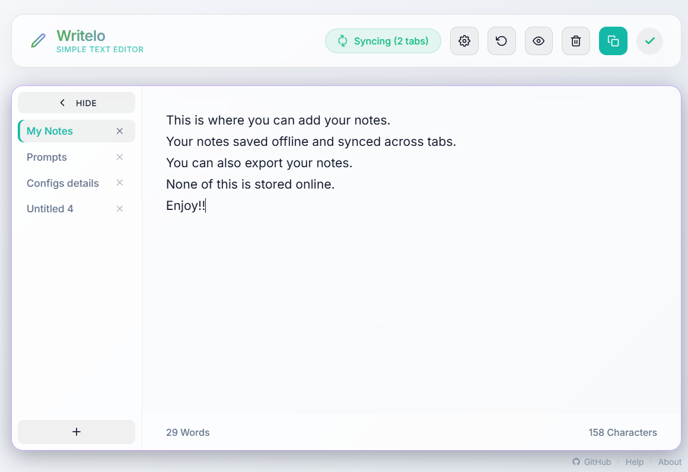

# Writelo — Simple Text Editor

A fast, beautiful, fully offline text editor that runs entirely in your browser. No account, no server, no installation — just open the file and start writing.

**GitHub:** https://github.com/saneeshnp/writelo

---



---

## Getting Started

Download the files and open `index.html` in any modern browser. That's it.

> **Note:** The Markdown Preview feature requires `marked.js` from jsDelivr CDN. All other features work completely offline.

---

## Features

### Writing & Editing
- **Auto-save** — your text is saved automatically to your browser's local storage as you type (600 ms debounce)
- **Multi-tab** — work on multiple documents at once; tabs appear on the left sidebar and are fully scrollable
- **Undo** — step back through your edit history with Ctrl+Z or the toolbar button (up to 50 states per tab)
- **Word & character count** — live stats shown at the bottom of the editor

### Finding & Replacing
- Enable Find & Replace in Settings (marked Experimental), then press **Ctrl+F** or click the search icon
- Navigate matches with the arrow buttons or Enter / Shift+Enter
- Replace one occurrence at a time or all at once
- When disabled, Ctrl+F falls through to the browser's native search

### Viewing & Copying
- **Markdown Preview** — render your text as formatted Markdown in a modal overlay
- **Copy All** — copy everything in the current tab to your clipboard in one click

### Customization
Open Settings (gear icon) to choose:

| Option | Choices |
|--------|---------|
| Theme | Dark, Light, Ultra Dark |
| Accent color | Purple, Blue, Green, Rose, Amber, **Teal** (default) |

The header logo, title gradient, and subtitle all update to match the chosen accent color.

### Export & Import
Back up and restore your notes from the **Settings → Data** section.

- **Export** — downloads a `writelo-backup-YYYY-MM-DD.json` file containing all your tabs
- **Import** — opens a file picker; after confirmation, replaces all current tabs with the backup's content
- **Include app settings** toggle — when checked, the export file also contains your theme, accent color, and feature flags, and import will restore them too

Exported JSON format:
```json
{
  "version": 1,
  "exportedAt": "ISO timestamp",
  "tabs": [{ "id", "name", "content" }],
  "activeTabId": "...",
  "settings": { "theme", "accentColor", "findAndReplace" }
}
```

> **Note:** Importing replaces all current notes. There is a confirmation prompt before anything is overwritten.

### Multiple Browser Tabs
If you open Writelo in more than one browser tab, they stay in sync automatically via the BroadcastChannel API. A "Live Sync" indicator appears in the header whenever multiple tabs are active.

---

## Keyboard Shortcuts

| Shortcut | Action |
|----------|--------|
| Ctrl+Z / Cmd+Z | Undo |
| Ctrl+F / Cmd+F | Open Find & Replace (when enabled) |
| Enter | Next match (in find panel) |
| Shift+Enter | Previous match (in find panel) |

---

## Tab Management

| Action | How |
|--------|-----|
| New tab | Click the + button at the bottom of the tab sidebar |
| Switch tab | Click the tab |
| Rename tab | Double-click the tab name |
| Close tab | Click × on the tab (requires more than one tab) |
| Duplicate / Close | Right-click the tab for a context menu |

---

## Data & Privacy

All your data stays on your device. Nothing is ever sent to a server.

| What | Where |
|------|-------|
| Tab content & names | `localStorage` → `jotdown_tabs_content` |
| Theme & color settings | `localStorage` → `jotdown_settings` |

Clearing your browser's site data will erase your saved notes.

---

## Browser Support

Works in any modern browser that supports the [BroadcastChannel API](https://caniuse.com/broadcastchannel) (Chrome, Firefox, Edge, Safari 15.4+).

---

## Project Structure

```
index.html   — App shell, UI markup, SVG icons
index.css    — All styles (CSS custom properties, themes, animations)
app.js       — All application logic (no build step, vanilla JS)
```

No frameworks. No build step. No dependencies except `marked.js` (CDN, optional).
